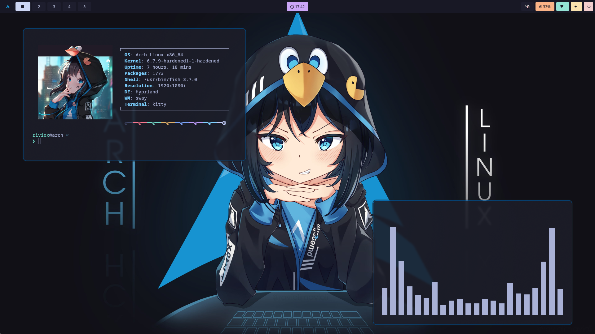

# My HyprLand dotfiles
- fish
- hyprland
- kitty
- rofi
- waybar
- hypridle
- hyprload
- hyprlock

# Required:
- swaybg
- hyprland
- fish
- kitty
- rofi
- hyprbar
- hypridle
- hyprload
- hyprlock
- neofetch

# Apps:
- **Discord Client:** Vencord
- **Browser:** Ungoogled Chromium
- **File manager:** Thunar
- **Terminal:** Kitty
- **Menu:** Rofi
- **Bar:** Waybar
- **Wallpaper:** Swaybg

## How to install
```
git clone https://github.com/riviox/dotfiles.git
cd dotfiles
chmod +x install.sh
./install.sh
```
## Binds:
- SUPER + Q: Open terminal (kitty).
- SUPER + C: Close active window.
- SUPER + M: Exit Sway.
- SUPER + E: Open file manager (Thunar).
- SUPER + SPACE: Toggle floating mode for the active window.
- SUPER + R: Open application launcher (Rofi).
- SUPER + P: Toggle pseudotiling (Dwindle layout).
- SUPER + J: Toggle split (Dwindle layout).
- Move focus with SUPER + arrow keys:

- SUPER + left: Move focus left.
- SUPER + right: Move focus right.
- SUPER + up: Move focus up.
- SUPER + down: Move focus down.
- Switch workspaces with SUPER + [0-9]:

- SUPER + F12: Fix wallpaper.
- Print: Copy area to clipboard.
- SUPER + B: Open browser (Chromium).
- SUPER + D: Open discord (vesktop).
- SUPER + L: Lock screen with Hyprlock.

- SUPER + Shift + KP_[0-9]: Move active window to the corresponding workspace.

- SUPER + S: Toggle special workspace (magic).
- SUPER + Shift + S: Move active window to special workspace (magic).
- Scroll through existing workspaces with SUPER + scroll:

- SUPER + mouse_down: Scroll to the next workspace.
- SUPER + mouse_up: Scroll to the previous workspace.
- Move/resize windows with SUPER + LMB/RMB and dragging: